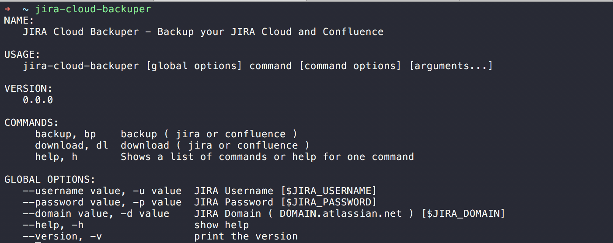
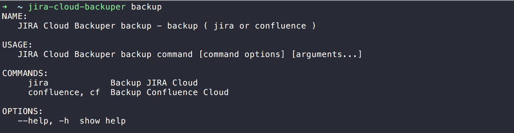
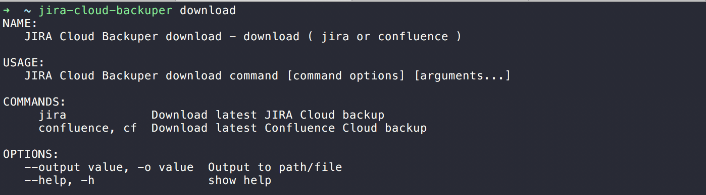

# jira-cloud-backuper
This application can be used to:

    * Backup JIRA Cloud and Confluence Cloud
    * Download latest JIRA Cloud and Confluence Cloud backup

# Usage
Call `jira-cloud-backuper -h` to get list of usable commands or read below.

**Main commands and flags:**

**Backup commands and flags:**

**Download commands and flags:**

# Installation
Download latest Release or `go install`
